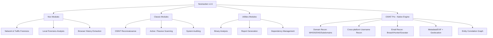

# Nostraxiten
> **Modular Framework for Security Auditing, OSINT, and Digital Forensics Analysis**

[](https://www.python.org/)
[-lightgrey.svg?style=for-the-badge&logo=target)](https://github.com/Nostraxiten/nostraxiten)
[](https://github.com/Nostraxiten/nostraxiten/releases)
[](#)

---

## Overview

**Nostraxiten** is an open-source security auditing and analysis framework designed to centralize and automate essential tasks in **OSINT**, **digital forensics analysis (DFIR)**, **network reconnaissance**, and **system diagnostics**.

Through an optimized interactive console interface (CLI), Nostraxiten unifies powerful industry-standard tools under a single modular environment, enabling security analysts, researchers, and enthusiasts to execute complex audits with ease.

> [!NOTE]
> **v1.6 Update:** **OSINT Pro** has been incorporated, a 100% native Python reconnaissance engine (no external binaries required) featuring Domain Recon, Cross-platform Username Recon, Email Recon with breach-checking, EXIF/GPS analysis, and an interactive entity correlation engine. API key management (Hunter.io, HaveIBeenPwned, VirusTotal, Onyphe, Shodan) is now exposed directly from the main menu.
>
> **v1.5 Update:** The system core was completely redesigned, optimizing the interactive interface performance and enhancing the cross-platform dependency manager for a seamless experience.

---

## System Interface


---

## Modular Architecture and Capabilities

Nostraxiten organizes its functions into three main pillars, enabling seamless transitions between different investigation methodologies:



### 1. Nox Modules (Deep Analysis and DFIR)
*   **Network Forensics:** Advanced traffic analysis and capture using `tshark` and `scapy`.
*   **Local Forensics Analysis:** Memory and hard drive artifact acquisition and extraction with `volatility`, `foremost`, and `bulk_extractor`.
*   **Browser Forensics:** Malware detection, history extraction, cookies, credentials, and local browser profile analysis.
*   **System Security:** Rootkit detection and system auditing with `chkrootkit` and `lynis`.

### 2. Classic Modules (OSINT & Network Auditing)
*   **OSINT Reconnaissance:** Passive information gathering and open-source intelligence collection with `theHarvester`, `recon-ng`, and `spiderfoot`.
*   **Network Scanning and Inventory:** Port mapping, service detection, and vulnerability identification via `nmap`.
*   **Wireless Auditing:** Utilities and scripts for local WiFi network audits.

### 3. Utilities Modules (Tools and Diagnostics)
*   **Binary Analysis:** Preliminary inspection of executables and suspicious files.
*   **Report Generator:** Consolidation of findings into structured reports for further analysis.
*   **Automatic Manager:** Intelligent installation of system dependencies and Python modules.

### 4. OSINT Pro — Native Engine (no external binaries)

Unlike the `classic` modules (which orchestrate external tools), the **OSINT Pro** suite is implemented in pure Python and requires no third-party binaries. It is the module set designed to compete in depth with frameworks like SpiderFoot or Maltego:

*   **[27] Domain Recon:** Native WHOIS client (sockets), complete DNS records, subdomain enumeration via Certificate Transparency (`crt.sh`) with parallel resolution, HTTP/TLS fingerprinting and heuristic technology detection (WordPress, Next.js, Cloudflare...), and lightweight common port scanning without root privileges.
*   **[28] Username Recon:** Concurrent username search across 80+ platforms (GitHub, social networks, forums, gaming, creative sites...) using an extensible in-house database at `data/osint_sites.json` — no dependency on `sherlock-project`.
*   **[29] Email Recon:** Syntax and MX validation, Gravatar checking, verification and enrichment via Hunter.io, and data breach checking via HaveIBeenPwned.
*   **[30] Metadata / EXIF Analyzer:** Extraction of metadata and GPS data embedded in images, with automatic Google Maps link generation.
*   **[31] Full Investigation:** Orchestrates all previous modules on the same case and correlates findings (domains, IPs, subdomains, usernames, profiles, emails, breaches, GPS locations...) in an **entity correlation graph**, exported as JSON, Graphviz DOT, and a self-contained interactive HTML visualization.
*   **[32] View Entity Graph:** Explore previous investigations and access their generated graphs/reports.

> Configure your API keys (Hunter.io, HaveIBeenPwned, VirusTotal, Onyphe, Shodan) from the **[98] Config API Keys** option in the main menu — without them, modules that use them degrade gracefully and report what is missing.

---

## System Requirements

*   **Runtime Environment:** Python 3.8 or higher.
*   **Permissions:** Administrator privileges (Windows) or `sudo`/root (Linux/Termux) to install system tools and manage network adapters.
*   **Internet Connection:** Required for initial dependency installation and OSINT queries.

---

## Installation Guide

Nostraxiten includes an **intelligent automated installer (Option `99`)** that configures Python requirements and detects missing operating system dependencies.

### 1. Clone the repository and navigate to it
```bash
git clone https://github.com/Nostraxiten/nostraxiten-framework.git
cd nostraxiten
```

### 2. Platform-Specific Configuration

Select your operating system to perform installation (automatic or manual):

#### Windows (PowerShell)
> [!TIP]
> Run the console as **Administrator** to ensure proper system tool configuration.

*   **Recommended Method (Integrated Installer):**
    ```powershell
    python nostraxiten.py
    # Select option 99 in the interactive menu to install dependencies automatically.
    ```
*   **Manual Method (Dependencies and Python):**
    ```powershell
    python -m pip install --upgrade pip
    python -m pip install requests colorama cryptography pycryptodome scapy pywin32
    ```
    *Download and manually install the following binaries by adding them to your PATH:*
    *   [Nmap](https://nmap.org/download.html) (Network scanning)
    *   [Wireshark / TShark](https://www.wireshark.org/) (Packet analysis)
    *   [Exiftool](https://exiftool.org/) (Metadata)
    *   [Steghide](https://github.com/StefanoDeVuono/steghide) (Steganography)

---

#### Linux (Debian/Ubuntu)
*   **Recommended Method (Integrated Installer):**
    ```bash
    python3 nostraxiten.py
    # Select option 99 in the interactive menu.
    ```
*   **Manual Method (APT & PIP Packages):**
    ```bash
    sudo apt update
    sudo apt install -y python3 python3-pip git nmap curl wget tshark binwalk exiftool steghide foremost bulk-extractor chkrootkit lynis
    python3 -m pip install --upgrade pip
    python3 -m pip install requests colorama cryptography pycryptodome scapy
    ```

---

#### Android (Termux)
*   **Recommended Method (Integrated Installer):**
    ```bash
    python3 nostraxiten.py
    # Select option 99 in the interactive menu.
    ```
*   **Manual Method:**
    ```bash
    pkg update && pkg upgrade -y
    pkg install python git nmap curl wget binwalk exiftool steghide foremost -y
    python3 -m pip install --upgrade pip
    python3 -m pip install requests colorama cryptography pycryptodome scapy
    ```

---

## Usage Guide

To launch the Nostraxiten interactive environment:

```bash
python nostraxiten.py
```

### Menu Navigation
1.  **Exploration:** The main menu groups tools by category.
2.  **Execution:** Enter the number of the module you want to launch and follow the on-screen instructions.
3.  **Custom Module Configuration:** Nostraxiten supports custom submodule execution. The tool automatically structures the `PYTHONPATH` to avoid library import conflicts.
4.  **Updates/Dependencies:** Enter `99` at any time to check and install the necessary dependencies for your current operating system.

---

## Repository Structure

The framework architecture is designed to be easily extensible:

```text
nostraxiten/
├── nostraxiten.py           # Main script and menu orchestrator
├── modules/                 # Directory of functional modules
│   ├── nox/                 # Deep analysis and forensics modules (DFIR)
│   │   ├── browser_forensics/
│   │   └── memory_analysis/
│   ├── classic/             # Wrappers for external tools (nmap, tshark, sherlock...)
│   └── osint/               # OSINT Pro — native engine (domain/username/email/metadata + graph)
├── data/                    # Static data (magic bytes, OSINT platform database)
├── config/                  # Persistent configuration (API keys, paths, preferences)
└── core/                    # Shared utilities (colors, HTTP session, environment, logging)
```

---

## Contributions and Development

Contributions to expand Nostraxiten's modules are always welcome!

To add a new module:
1.  Identify the appropriate category for your module (`nox` for DFIR and deep analysis, or `classic` for OSINT and general utilities).
2.  Develop the script by integrating the standardized color handlers and outputs from the `utils/` folder.
3.  Register your module in the `nostraxiten.py` interactive menu to ensure the framework properly configures the `PYTHONPATH` during execution.

---

## Disclaimer

> [!WARNING]
> This framework and its modules are designed exclusively for educational purposes, academic research, authorized security audits, and forensic analysis under explicit legal consent. Unauthorized use of Nostraxiten to perform unauthorized activities is the sole responsibility of the end user. The authors and contributors are not responsible for any damage caused by misuse of this tool.

